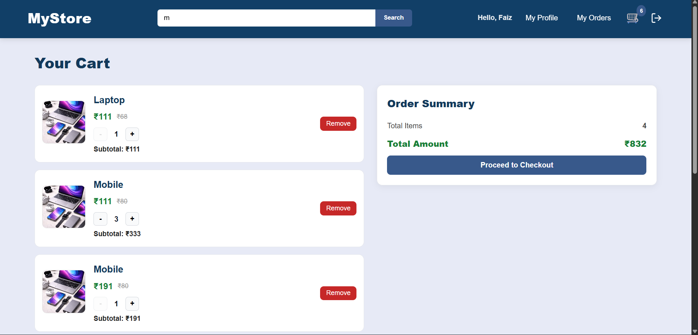
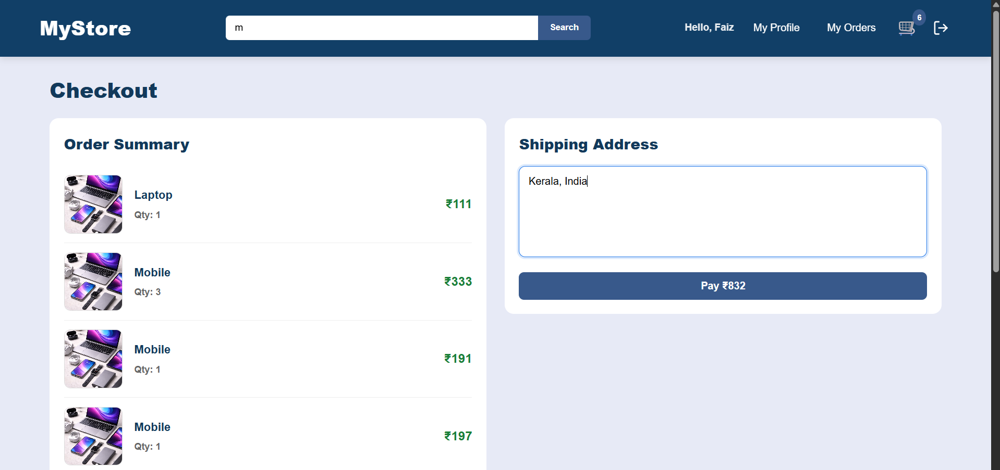
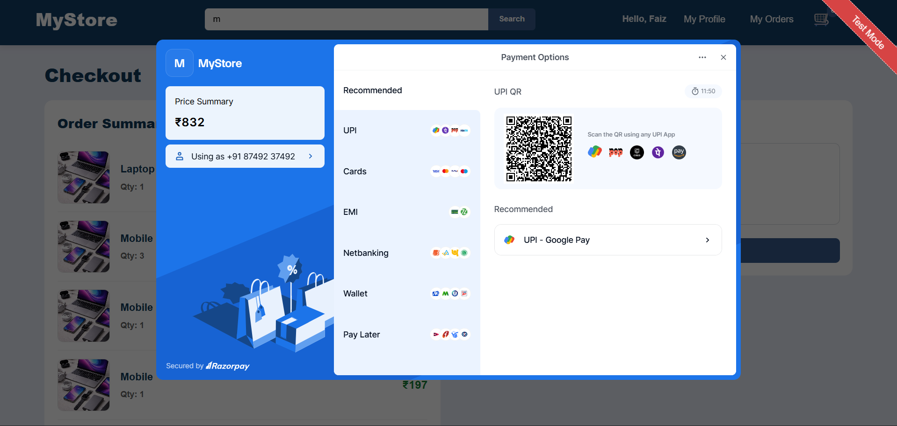
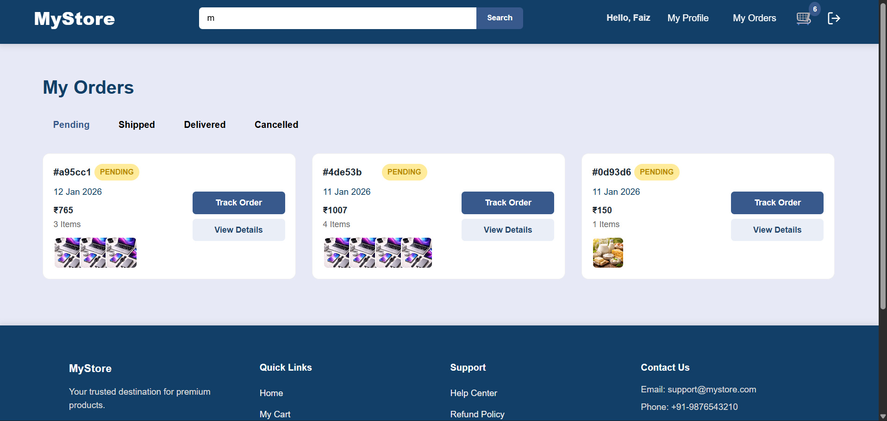

# 🛒 Ecommerce Application (Full Stack)

A full-stack ecommerce application built with a Node.js + Express backend and a React (Vite) frontend.  
The project follows a clean separation of concerns with independent frontend and backend folders.

---

## 📁 Project Structure

ecommerce-app/
│
├── ecommerce-backend/ # Backend (Node.js, Express, MongoDB)
├── ecommerce-frontend/ # Frontend (React, Vite)
└── README.md

---

## 🚀 Features

### Backend

- User authentication using JWT
- Password hashing with bcrypt
- Secure API using Helmet and rate limiting
- Cookie-based authentication
- MongoDB integration with Mongoose
- Razorpay payment gateway integration
- CORS-enabled REST APIs

### Frontend

- Built with React 19 and Vite
- Global state management using Redux Toolkit
- Form handling with React Hook Form and Zod
- Client-side routing using React Router v7
- Charts and analytics using Chart.js
- Responsive UI with reusable components

---

## 🧰 Tech Stack

### Backend

- Node.js
- Express.js
- MongoDB
- Mongoose
- JWT
- Razorpay

### Frontend

- React 19
- Vite
- Redux Toolkit
- React Router
- Axios
- Chart.js
- Zod

---

## ⚙️ Backend Setup

1. Navigate to backend directory

cd ecommerce-backend

2. Install dependencies

npm install

3. Create a .env file

PORT=5000  
MONGO_URI=your_mongodb_connection_string  
ACCESS_SECRET_KEY=your_jwt_access_key
REFRESH_SECRET_KEY=your_jwt_refresh_key
CLIENT_URL=your_frontend_domain
RAZORPAY_KEY_ID=your_key_id  
RAZORPAY_KEY_SECRET=your_key_secret

4. Start the backend server

npm start

Backend runs on http://localhost:5000

---

## ⚙️ Frontend Setup

1. Navigate to frontend directory

cd ecommerce-frontend

2. Install dependencies

npm install

3. Start development server

npm run dev

Frontend runs on http://localhost:5173

---

## 🔗 API Communication

- Frontend communicates with backend using Axios
- Backend must be running before frontend
- Configure API base URL as required

---

## 🛠 Available Scripts

### Backend

- npm start

### Frontend

- npm run dev
- npm run build
- npm run preview
- npm run lint

---

## 🔒 Security Notes

- Do not commit .env files
- Keep JWT secrets and payment keys private
- Use HTTPS in production

---

## 📦 Future Enhancements

- Admin dashboard
- Product reviews and ratings
- Order history
- Payment success and failure pages
- Cloud deployment

---

## 📸 UI Screenshots

### Home page

### cart

### orders

---

## 🤝 Contributing

1. Fork the repository
2. Create a new branch
3. Commit your changes
4. Open a Pull Request

---

## 📄 License

ISC License
