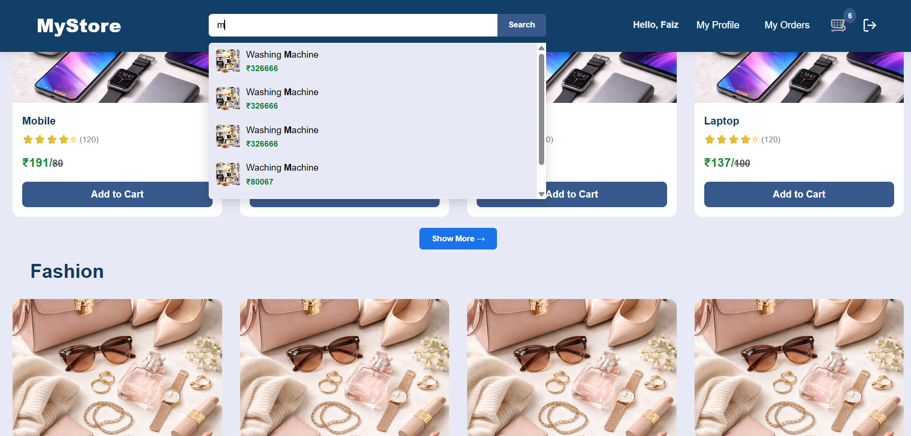
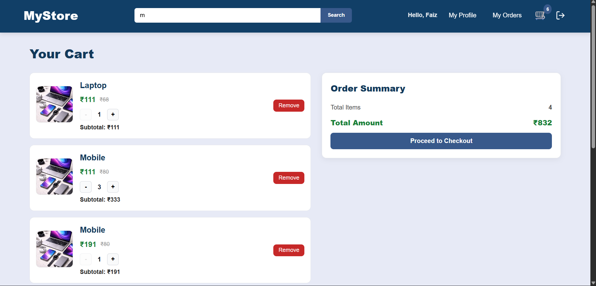
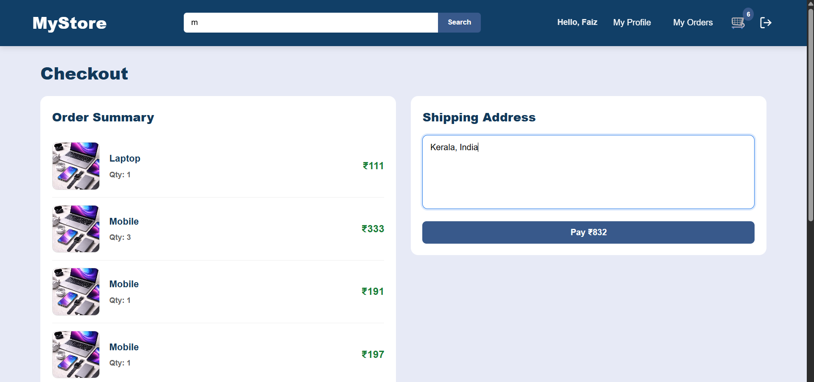
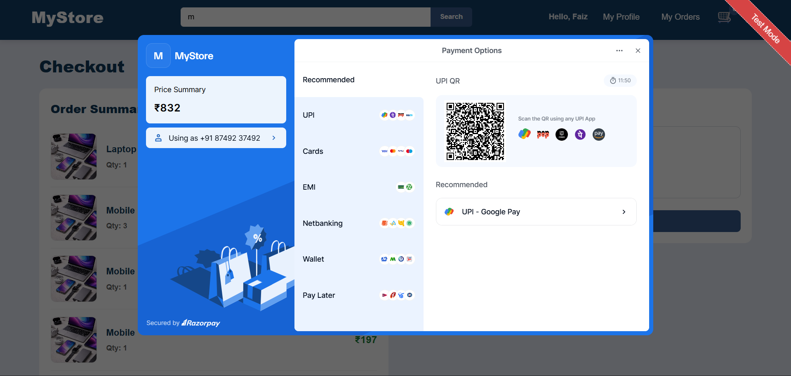
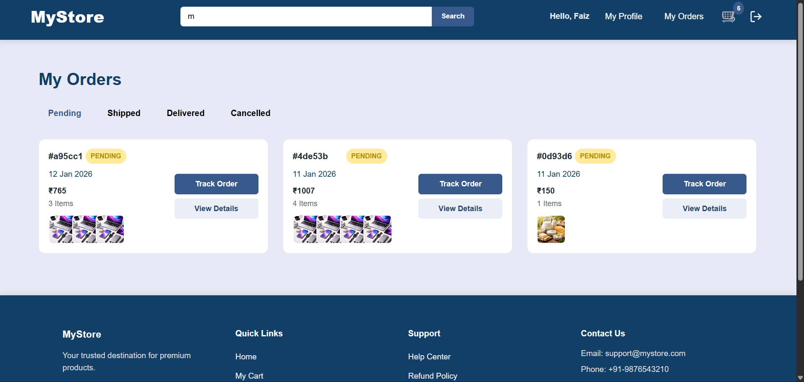
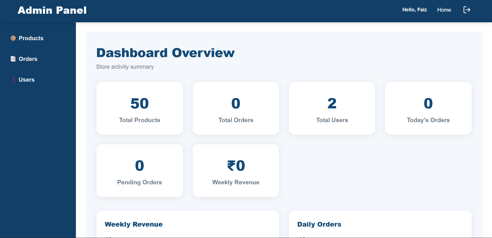
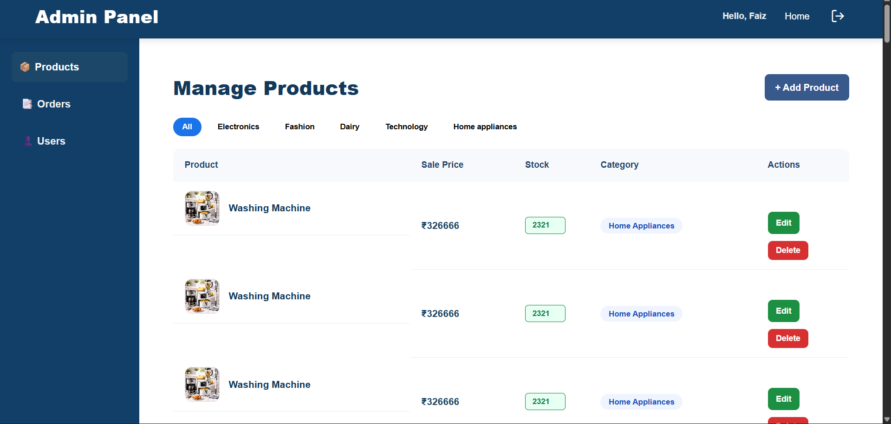
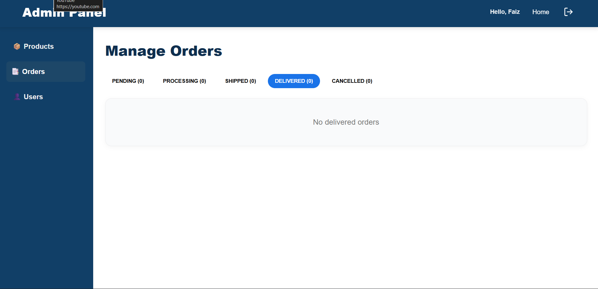

# MyStore — Full Stack Ecommerce Application

A production-ready full-stack ecommerce platform built with a Node.js + Express backend and a React 19 + Vite frontend. Features complete shopping workflows, Razorpay payment integration, Google OAuth, admin dashboard with analytics, and a fully Tailwind CSS styled UI.

---

## Project Structure

```
ecommerce-app/
├── ecommerce-backend/      # Node.js + Express + MongoDB REST API
├── ecommerce-frontend/     # React 19 + Vite + Tailwind CSS
└── README.md
```

---

## Features

### Customer
- Browse products by category with live search and autocomplete
- Product detail pages with image gallery, discount badges, stock status
- Add to cart, update quantities, remove items
- Checkout with shipping address and Razorpay payment gateway
- Order tracking with live status timeline (Ordered → Shipped → Delivered)
- Order history with status tabs (Pending, Shipped, Delivered, Cancelled)
- Cancel pending orders
- User profile management (view, edit, change password)
- Google OAuth sign-in and password-based authentication

### Admin
- Dashboard with revenue/orders charts (Chart.js) and KPI stats
- Full product management — add, edit, delete, update stock inline
- Order management — update order status, cancel orders
- User management — promote/demote between customer and admin roles
- Image upload via Cloudinary drag-and-drop interface

### Technical
- JWT access + refresh token authentication with HTTP-only cookies
- Redis caching for product listings
- Regex-safe product search with server-side pagination
- Cascade delete for user data (orders + cart on user deletion)
- Rate limiting and security headers via Helmet
- Environment-aware cookie settings (sameSite, secure) for cross-origin production
- HTTPS redirect enforcement in production

---

## Tech Stack

### Backend
| Package | Purpose |
|---|---|
| Express 5 | HTTP server and routing |
| Mongoose 9 | MongoDB ODM |
| JWT | Access + refresh token auth |
| bcrypt | Password hashing |
| Razorpay | Payment gateway |
| Google Auth Library | OAuth verification |
| Redis | Product listing cache |
| Helmet | Security headers |
| express-rate-limit | API rate limiting |
| cookie-parser | HTTP-only cookie handling |

### Frontend
| Package | Purpose |
|---|---|
| React 19 + Vite | UI framework and bundler |
| Tailwind CSS 3 | Utility-first styling |
| Redux Toolkit | Global state management |
| React Router 7 | Client-side routing |
| React Hook Form + Zod | Form handling and validation |
| Axios | HTTP client |
| Chart.js + react-chartjs-2 | Admin analytics charts |
| React Toastify | Toast notifications |
| Lucide React | Icon set |
| Google OAuth (@react-oauth/google) | Google sign-in |
| react-slick | Hero carousel |

---

## Backend Setup

```bash
cd ecommerce-backend
npm install
```

Create a `.env` file:

```env
PORT=5000
MONGO_URI=your_mongodb_connection_string
ACCESS_SECRET_KEY=your_jwt_access_secret
REFRESH_SECRET_KEY=your_jwt_refresh_secret
CLIENT_URL=http://localhost:5173
RAZORPAY_KEY_ID=your_razorpay_key_id
RAZORPAY_KEY_SECRET=your_razorpay_key_secret
REDIS_URL=your_redis_url
GOOGLE_CLIENT_ID=your_google_client_id
NODE_ENV=development
```

Start the server:

```bash
npm start
```

Runs on `http://localhost:5000`

---

## Frontend Setup

```bash
cd ecommerce-frontend
npm install
```

Create a `.env` file:

```env
VITE_API_URL=http://localhost:5000/api
VITE_GOOGLE_CLIENT_ID=your_google_client_id
VITE_CLOUDINARY_UPLOAD_PRESET=your_cloudinary_preset
VITE_CLOUDINARY_CLOUD_NAME=your_cloud_name
```

Start the dev server:

```bash
npm run dev
```

Runs on `http://localhost:5173`

---

## API Overview

| Method | Endpoint | Description |
|---|---|---|
| POST | `/api/user/signup` | Register new user |
| POST | `/api/user/login` | Login with email/password |
| POST | `/api/user/google-login` | Login with Google OAuth |
| POST | `/api/user/logout` | Logout |
| GET | `/api/user/profile` | Get current user profile |
| PUT | `/api/user/profile` | Update profile |
| PUT | `/api/user/password` | Change password |
| GET | `/api/product` | Get all products |
| GET | `/api/product/:id` | Get product by ID |
| GET | `/api/product/search` | Search/filter products |
| POST | `/api/product` | Admin: add product |
| PUT | `/api/product/:id` | Admin: update product |
| DELETE | `/api/product/:id` | Admin: delete product |
| GET | `/api/cart` | Get user cart |
| POST | `/api/cart` | Add item to cart |
| PUT | `/api/cart/increase` | Increase item quantity |
| PUT | `/api/cart/decrease` | Decrease item quantity |
| DELETE | `/api/cart/:productId` | Remove item from cart |
| POST | `/api/order` | Place order |
| GET | `/api/order` | Get user orders |
| GET | `/api/order/:id` | Track order by ID |
| PUT | `/api/order/:id/cancel` | Cancel order |
| POST | `/api/payment/create-order` | Create Razorpay order |

---

## Available Scripts

### Backend
```bash
npm start        # Start server with Node
```

### Frontend
```bash
npm run dev      # Start dev server
npm run build    # Production build
npm run preview  # Preview production build
npm run lint     # Run ESLint
```

---

## Security Notes

- Never commit `.env` files
- Keep JWT secrets and Razorpay keys private
- Use HTTPS in production — the backend enforces redirects when `NODE_ENV=production`
- Cookies are `httpOnly`, `secure`, and `sameSite=none` in production

---

## UI Screenshots

### Home




### Cart







### Orders



### Admin Dashboard







---

## License

ISC License
